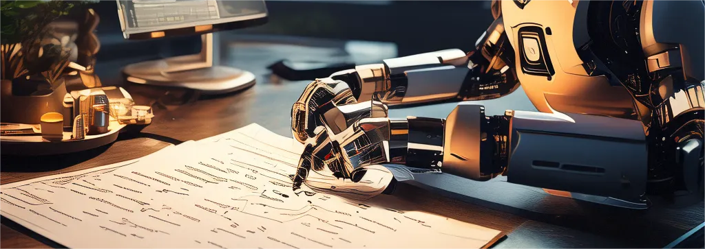

<p align="left">
    
</p>

# LLM-Data-Cleaner
简体中文 | [English](README_en.md)

## 更新
- 看来有人专门训练LLM来干这些活了。见[refuel-llm-2](https://www.refuel.ai/blog-posts/announcing-refuel-llm-2)。
- 关于OCR，可以用[Nougat](https://github.com/facebookresearch/nougat)。
## 背景
未来人类会用大模型预加工所有数据。本项目旨在结合大模型来批量预处理数据，以支持科研目的。 现阶段支持OCR功能, 支持使用的大模型有 qwen(通义千问), moonshot(月之暗面), PaddleOCR(百度飞桨OCR), openai, Llava。
## 启动
克隆并且进入仓库
```bash
git clone https://github.com/jackfsuia/LLM-Data-Cleaner.git && cd LLM-Data-Cleaner
```
进入仓库然后跑下面命令启动OCR
```bash
python start_ocr.py --model MODEL --key YOUR_API_KEY --img_path /path/to/images/ --outdir /path/to/output/ --lang language
```
**MODEL** 的值可以是 ["qwen"(通义千问)](https://help.aliyun.com/zh/dashscope/developer-reference/activate-dashscope-and-create-an-api-key), ["moonshot"(月之暗面)](https://platform.moonshot.cn/console/api-keys), ["paddle"(百度飞桨OCR)](https://github.com/PaddlePaddle/PaddleOCR), ["openai"](https://platform.openai.com/docs/models/overview)和[llava](https://github.com/haotian-liu/LLaVA). **YOUR_API_KEY** 是你申请的API KEY，没有的话点上面相应的模型字体链接申请， paddle, llava不需要。 **/path/to/images/** 是图片目录, 里面所有图片都会被OCR, 结果保存在 **/path/to/output/** data.jsonl。 **language** 是识别的语言，值可以是 ch (中文), en (英文), fr (法语), german (德语), korean (韩语), japan (日语), 只有百度飞桨OCR可能会用到。
## 示例
假如你要用通义千问的qwen-vl-plus模型做OCR，API密钥是sbadgassjda，图片数据所在目录是/images/，结果输出data.jsonl文件目录是/images/，无论是识别什么语言，你都应该跑下面的代码
```bash
python start_ocr.py --model qwen-vl-plus --key sbadgassjda --img_path /images/ --outdir /images/
```
假如你要用百度飞桨OCR做OCR，图片数据所在目录是/images/，希望结果输出data.jsonl文件目录是/images/，语言是中文，那你应该跑下面的代码
```bash
python start_ocr.py --model paddle --img_path /images/ --outdir /images/ --lang ch
```
假如你要用 `llava`, 跑下面的代码
```bash
python start_ocr --model LLAVA_PATH --img_path /images/ --outdir /images/
```
`LLAVA_PATH`` is 你的llava模型路径(HuggingFace类的模型路径).
## 附录
OCR的提示词存在文件[ocr.py](models/ocr.py)里。
## 许可

项目许可证是[LICENSE](LICENSE)。
