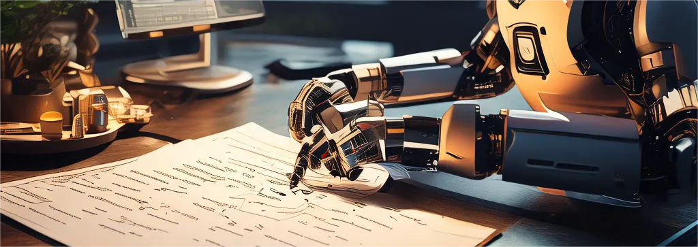

<p align="left">
    
</p>

# LLM-Data-Cleaner
English | [简体中文](README.md)
## Updates
- Looks like people have been training LLMs to do those clean jobs, see [refuel-llm-2](https://www.refuel.ai/blog-posts/announcing-refuel-llm-2).
- As for OCR，you can use [Nougat](https://github.com/facebookresearch/nougat), [Marker](https://github.com/VikParuchuri/marker) or multimodal models like [MiniCPM-V](https://github.com/OpenBMB/MiniCPM-V), they work pretty well.
## Background
In future human will use LLM to preprocess all data. This project assembles LLMs and old tools to generate or clean data for academic use. For now it supports OCR, using various models like PaddleOCR, OpenAI, Llava, qwen, moonshot.
## Start
Clone and enter the repo
```bash
git clone https://github.com/jackfsuia/LLM-Data-Cleaner.git && cd LLM-Data-Cleaner
```
then to start OCR, run 
```bash
python start_ocr.py --model MODEL --key YOUR_API_KEY --img_path /path/to/images/ --outdir /path/to/output/ --lang language --batchsize batchsize
```
**MODEL** can be [qwen](https://help.aliyun.com/zh/dashscope/developer-reference/activate-dashscope-and-create-an-api-key), [moonshot](https://platform.moonshot.cn/console/api-keys), [paddle](https://github.com/PaddlePaddle/PaddleOCR), [openai](https://platform.openai.com/docs/models/overview) and [llava](https://github.com/haotian-liu/LLaVA). **YOUR_API_KEY** is the API KEY, not needed for paddle and llava. **/path/to/images/** is the images folder, it will ocr all the images under that path, and save the result to the file **/path/to/output/** data.jsonl. **language** can be ch (Chinese), en (English), fr (French), german (German), korean (Korean), japan (Japanese), it is only used by paddle. **batchsize** is batch size, also the number of threads to process the images, default to be the size of the target dataset.
## Examples
If you use `gpt-4-turbo` for OCR and your API key is `sbadgassjda`，the images data are in `/images/`，and the output `data.jsonl` is wished to be in `/images/` too, whatever language is, run
```bash
python start_ocr.py --model gpt-4-turbo --key sbadgassjda --img_path /images/ --outdir /images/
```
If you use `PaddleOCR`, the images data are in `/images/`，and the output `data.json`l is wished to be in `/images/` too, the OCR target language is `English`，run
```bash
python start_ocr --model paddle --img_path /images/ --outdir /images/ --lang en
```
If you use `llava`, run
```bash
python start_ocr --model LLAVA_PATH --img_path /images/ --outdir /images/
```
`LLAVA_PATH`` is your huggingface-like llava model path.
## Appendix
The mission prompt for OCR is in [ocr.py](models/ocr.py) in case you want to change it.
## License

LLM-Data-Cleaner is licensed under the MIT License found in the [LICENSE](LICENSE) file in the root directory of this repository.
